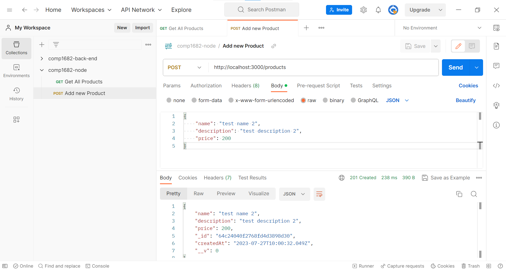

## Create Mongoose Model

In the models folder, create a file named `product.js`:

```js
// models/product.js
const mongoose = require("mongoose");

const productSchema = new mongoose.Schema({
  name: { type: String, required: true },
  description: { type: String, required: true },
  price: { type: Number, required: true },
  createdAt: { type: Date, default: Date.now },
});

const Product = mongoose.model("Product", productSchema);

module.exports = Product;
```

## Create the Repository

In the repositories folder, create a file named `productRepository.js`

```js
// repositories/productRepository.js
const Product = require("../models/product");

class ProductRepository {
  async createProduct(data) {
    return await Product.create(data);
  }

  async getAllProducts() {
    return await Product.find();
  }

  async getProductById(id) {
    return await Product.findById(id);
  }

  async updateProduct(id, data) {
    return await Product.findByIdAndUpdate(id, data, { new: true });
  }

  async deleteProduct(id) {
    return await Product.findByIdAndDelete(id);
  }
}

module.exports = new ProductRepository();
```

## Create Express Routes

In the routes folder, create a file named `productRoutes.js`

```js
// routes/productRoutes.js
const express = require("express");
const router = express.Router();
const productController = require("../controllers/productController");

// Create a new product
router.post("/", productController.createProduct);

// Get all products
router.get("/", productController.getAllProducts);

// Get a product by ID
router.get("/:id", productController.getProductById);

// Update a product by ID
router.put("/:id", productController.updateProduct);

// Delete a product by ID
router.delete("/:id", productController.deleteProduct);

module.exports = router;
```

## Create Express Controllers

In the controllers folder, create a file named `productController.js`:

```js
// controllers/productController.js
const productRepository = require("../repositories/productRepository");

class ProductController {
  async createProduct(req, res) {
    try {
      const product = await productRepository.createProduct(req.body);
      res.status(201).json(product);
    } catch (err) {
      res.status(500).json({ error: "Unable to create the product" });
    }
  }

  async getAllProducts(req, res) {
    try {
      const products = await productRepository.getAllProducts();
      res.json(products);
    } catch (err) {
      res.status(500).json({ error: "Unable to fetch products" });
    }
  }

  async getProductById(req, res) {
    try {
      const product = await productRepository.getProductById(req.params.id);
      if (!product) {
        return res.status(404).json({ error: "Product not found" });
      }
      res.json(product);
    } catch (err) {
      res.status(500).json({ error: "Unable to fetch the product" });
    }
  }

  async updateProduct(req, res) {
    try {
      const product = await productRepository.updateProduct(
        req.params.id,
        req.body
      );
      if (!product) {
        return res.status(404).json({ error: "Product not found" });
      }
      res.json(product);
    } catch (err) {
      res.status(500).json({ error: "Unable to update the product" });
    }
  }

  async deleteProduct(req, res) {
    try {
      const product = await productRepository.deleteProduct(req.params.id);
      if (!product) {
        return res.status(404).json({ error: "Product not found" });
      }
      res.sendStatus(204);
    } catch (err) {
      res.status(500).json({ error: "Unable to delete the product" });
    }
  }
}

module.exports = new ProductController();
```

## Set Up Express Server

In the `server.js` file, set up the Express server:

```js
// server.js
const express = require("express");
const mongoose = require("mongoose");
const dotenv = require("dotenv");
const productRoutes = require("./src/routes/productRoutes");

dotenv.config();
const app = express();
const PORT = process.env.PORT || 3000;
const MONGODB_URI = process.env.MONGODB_URI;

// Middleware
app.use(express.json());

// Connect to MongoDB
mongoose
  .connect(MONGODB_URI, { useNewUrlParser: true, useUnifiedTopology: true })
  .then(() => {
    console.log("Connected to MongoDB");
  })
  .catch((err) => {
    console.error("Error connecting to MongoDB:", err);
    process.exit(1);
  });

// Routes
app.use("/products", productRoutes);

// Start the server
app.listen(PORT, () => {
  console.log(`Server listening on port ${PORT}`);
});
```

## Start the Server

Run the server using the following command:

```bash
node server.js
```

## Use Postman to test the server

Use Postman to test `GET` and `POST` requests with the Server



