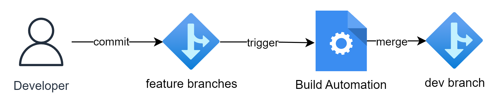
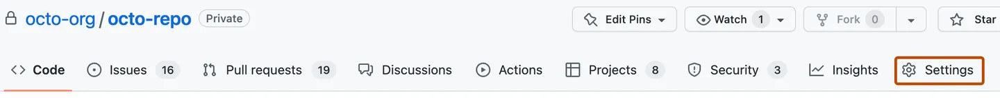
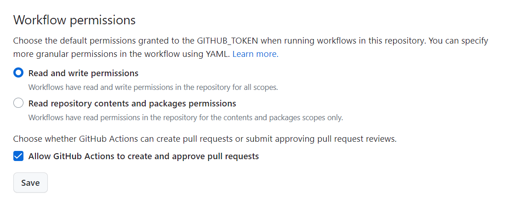
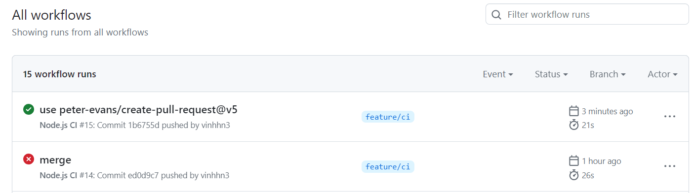
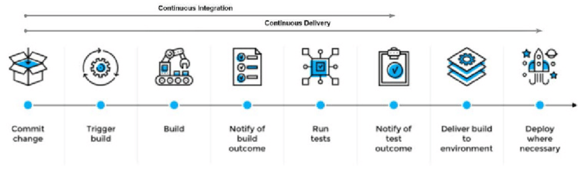

## Set up Continuous Integration (CI) using GitHub Actions

## Overview

The diagrams below shows a simple CI workflow



### Create a Workflow File

In your repository, create a `.github/workflows` folder if it doesn't already exist. Inside this folder, create a new file named `nodejs.yml`. This file will define the GitHub Actions workflow for your Node.js API.

```yml
# nodejs.yml
name: Node.js CI

on:
  push:
    branches:
      - feature/** # Trigger the build on commits to any feature branch

jobs:
  build:
    runs-on: ubuntu-latest

    steps:
      - name: Checkout code
        uses: actions/checkout@v2

      - name: Use Node.js
        uses: actions/setup-node@v2
        with:
          node-version: 18.16.1

      - name: Install dependencies
        run: npm install

      - name: Merge to Dev
        uses: "peter-evans/create-pull-request@v5"
        with:
          token: ${{ secrets.GITHUB_TOKEN }}
          branch: dev
          title: "Merge feature branch to dev"
          body: "Automatically merging feature branch to dev"
          labels: "auto-merge"
```

This workflow ensures that whenever code changes are pushed to a `feature` branch, it will build the Node.js project, install its dependencies, and if the build is successful, create a new pull request merging the changes from the feature branch into a `dev` branch.

## Configuring the default GITHUB_TOKEN permissions

By default, when you create a new repository in your personal account, GITHUB_TOKEN only has read access for the contents and packages scopes. If you create a new repository in an organization, the setting is inherited from what is configured in the organization settings.

On GitHub.com, navigate to the main page of the repository.

Under your repository name, click Settings. If you cannot see the "Settings" tab, select the dropdown menu, then click Settings.



Screenshot of a repository header showing the tabs. The "Settings" tab is highlighted by a dark orange outline.

In the left sidebar, click Actions, then click General.

Under "Workflow permissions", choose whether you want the GITHUB_TOKEN to have read and write access for all scopes (the permissive setting), or just read access for the contents and packages scopes (the restricted setting).



Click Save to apply the settings.

## Create the `dev` branch

Be aware to create `dev` branch by using the command

```bash
git branch dev main
```

## Commit and Push the Workflow

Commit the `nodejs.yml` workflow file and push it to the `main` branch of your repository.

## Verify the CI Workflow

GitHub Actions will automatically detect the new workflow file, and the CI process will start running when you push changes to the main branch. You can check the progress and results of the CI workflow on the "Actions" tab in your GitHub repository.

If all the tests pass successfully, the CI workflow will complete successfully, and you will see a green checkmark indicating the successful build.



## Next steps

This is just a simple CI workflow. In real scenario, we have to create the complex workflow as shows below


