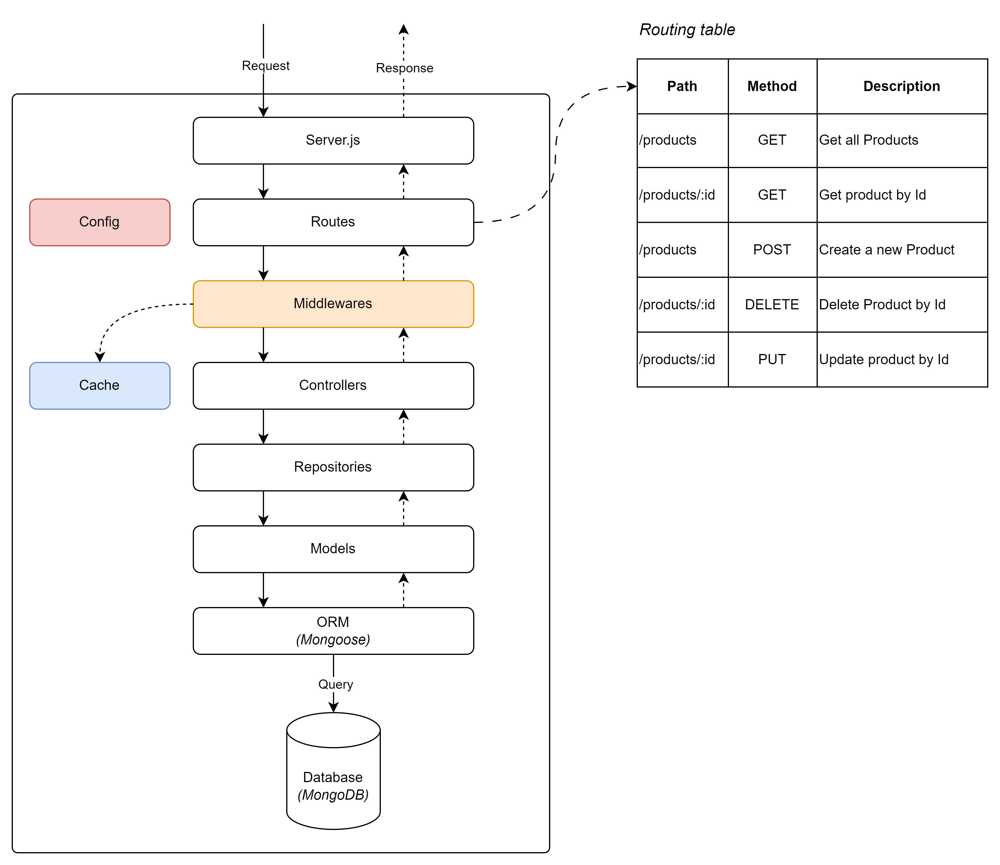
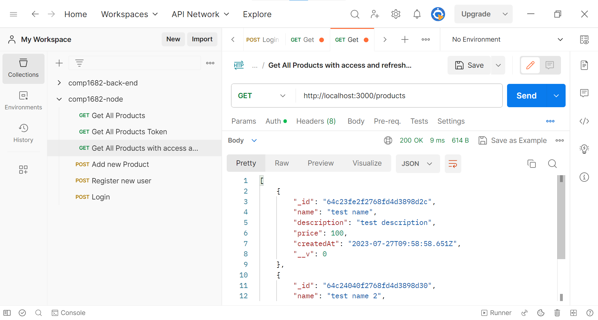

## Implement cache




To implement caching in your API using memory-cache, we'll use it to store the results of expensive database queries or calculations temporarily in memory.

This can help reduce the load on the database and improve the API's response time. Let's integrate memory-cache into the API:

## Install the Memory Cache Dependency

Install the memory-cache package

```bash
npm install memory-cache
```

## Create a Cache Middleware

In the middlewares folder, create a file named `cacheMiddleware.js`

```js
// middlewares/cacheMiddleware.js
const cache = require("memory-cache");

function cacheMiddleware(duration) {
  return (req, res, next) => {
    const key = "__express__" + req.originalUrl || req.url;
    const cachedBody = cache.get(key);

    if (cachedBody) {
      return res.json(cachedBody);
    } else {
      res.sendResponse = res.json;
      res.json = (body) => {
        cache.put(key, body, duration * 1000); // Convert seconds to milliseconds
        res.sendResponse(body);
      };
      next();
    }
  };
}

module.exports = cacheMiddleware;
```

## Apply Caching to the Product Routes

In the `routes/productRoutes.js` file, apply the cache middleware to the route that retrieves all products:

```js
// routes/productRoutes.js
const express = require("express");
const router = express.Router();
const productController = require("../controllers/productController");
const cacheMiddleware = require("../middlewares/cacheMiddleware");

// Cache the response for 5 minutes (adjust the duration as needed)
router.get("/", cacheMiddleware(300), productController.getAllProducts);

// ... (other routes)
```

## Clear Cache When Data is Updated

In some cases, you might want to clear the cache when data is updated to ensure that users get the latest information.

For example, when a new product is added or an existing product is updated, you can clear the cache for the `/products` route:

```js
// controllers/productController.js
const cache = require("memory-cache");

class ProductController {
  // ... (other methods)

  async createProduct(req, res) {
    try {
      // ... (create product logic)

      // Clear cache for /products route
      cache.clear();

      res.status(201).json(product);
    } catch (err) {
      res.status(500).json({ error: "Unable to create the product" });
    }
  }

  async updateProduct(req, res) {
    try {
      // ... (update product logic)

      // Clear cache for /products route
      cache.clear();

      res.json(product);
    } catch (err) {
      res.status(500).json({ error: "Unable to update the product" });
    }
  }

  // ... (other methods)
}
```

With these changes, your API now includes caching using memory-cache. Cached responses will be served from memory for a specified duration, reducing the load on the database and improving the API's performance. Remember to apply caching only to routes where it makes sense to use it and to clear the cache when relevant data is updated to ensure accurate results.

## Test with Postman

The 2nd request is much faster than the first request (around 30 times faster)

First request


Second request

