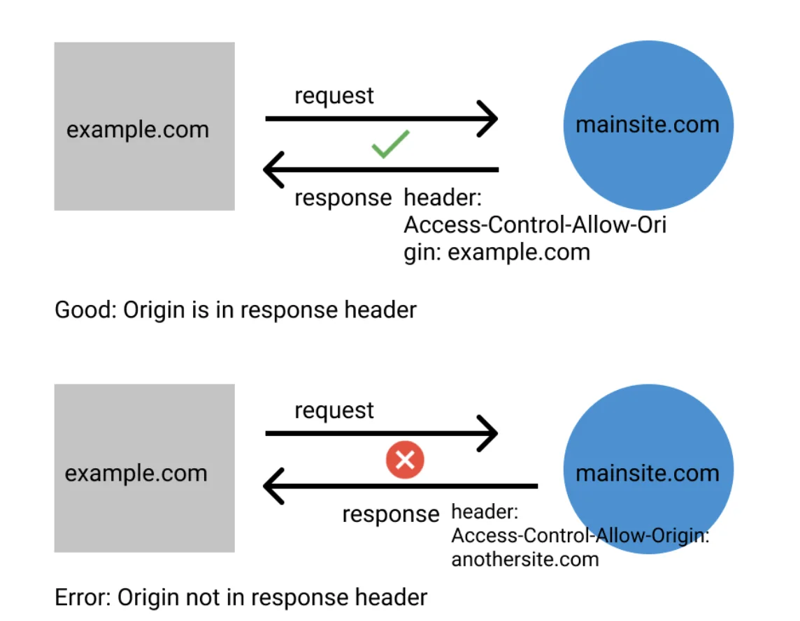

## What Is CORS?

CORS is a mechanism that can be found in modern web browsers like Chrome, Firefox, Safari, and Edge. It prevents Domain A from accessing resources on Domain B without explicit permission.

According to the MDN Docs, "Cross-Origin Resource Sharing (CORS) is an HTTP-header based mechanism that allows a server to indicate any other origins (domain, scheme, or port) than its own from which a browser should permit loading of resources."

The permission for which external domains may access resources on Domain B must be defined on Domain B. The permission is set using the Access-Control-Allow-Origin header. For example, if Domain A is example.com and Domain B is mainsite.com, the correct header will be the following:

```bash
Access-Control-Allow-Origin: example.com
```



## HTTP headers

HTTP headers are channels through which the browser and server pass additional information. There are two cases in which headers are used. In the first, the client browser sends additional information to the server while making a request. In the second case, a server sends additional information to the client along with the response.

The browser may use headers to authenticate with a server. The server, on the other hand, can respond with a header telling the browser which resources it can access. CORS response is sent back to the browser using a header.

The following is an example of a header response for an HTTP request:

```bash
accept-ranges: "bytes"
content-length: "785"
content-type: "text/html; charset=UTF-8"
date: "Sun, 01 Aug 2021 02:00:35 GMT"
etag: "W/\"311-4gBYPqEJbr0hYJMBrIkiiBUknS4\"
```

Each header is made up of a key and a value. The name of the key is case insensitive.

## Add CORS to the project

### Install the CORS Middleware

Install the cors package:

```bash
npm install cors
```

### Configure CORS in the Express Server

In the server.js file, configure CORS in your Express server:

```js
// server.js

/// ... (other imports)

const cors = require("cors"); // Import the cors middleware

// ... (previous code)

// Example with specific CORS options
const corsOptions = {
  origin: "https://example.com", // Replace with the allowed origin(s)
  methods: "GET, POST, PUT, DELETE",
  allowedHeaders: "Content-Type, Authorization",
};

app.use(cors(corsOptions));

// ... (remaining code)
```

Using the above example, the API will only accept requests from https://example.com and allow only specific methods and headers.

For this demo project, we will use `*` for cors options for testing purposes

```js
app.use(
  cors({
    origin: "*",
  })
);
```
