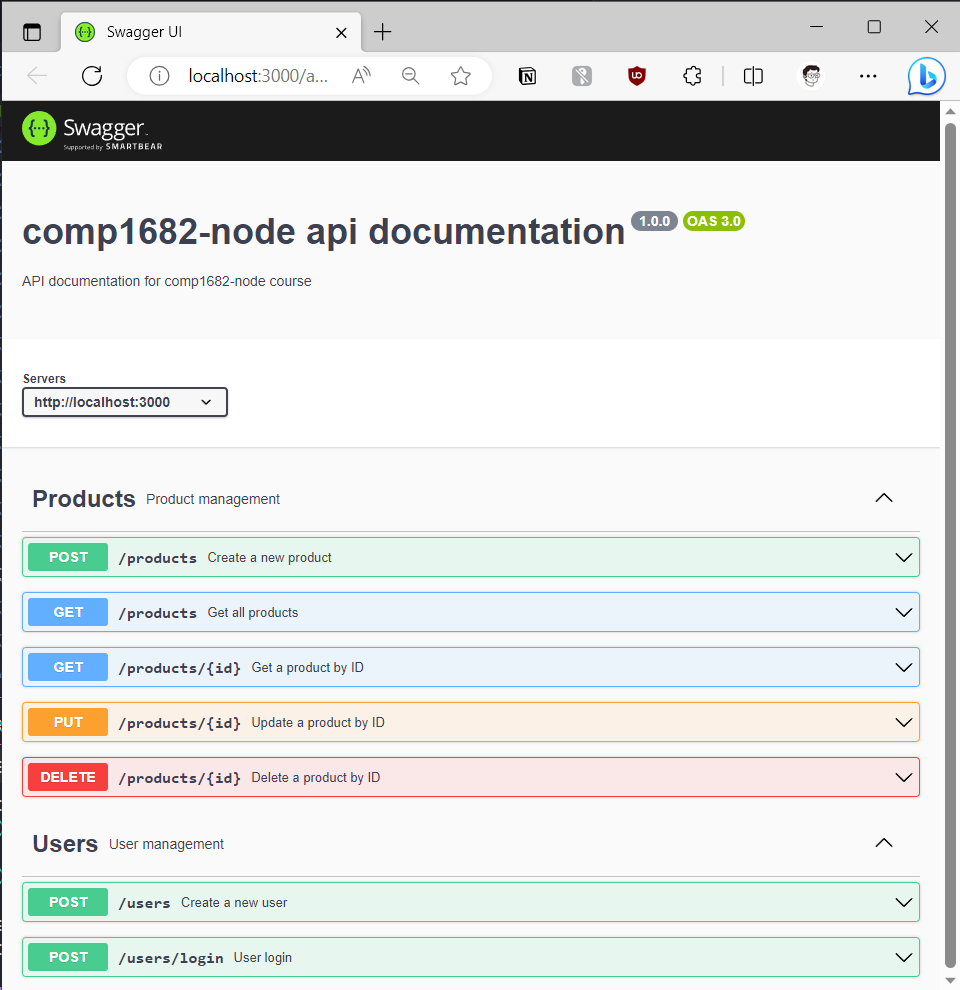
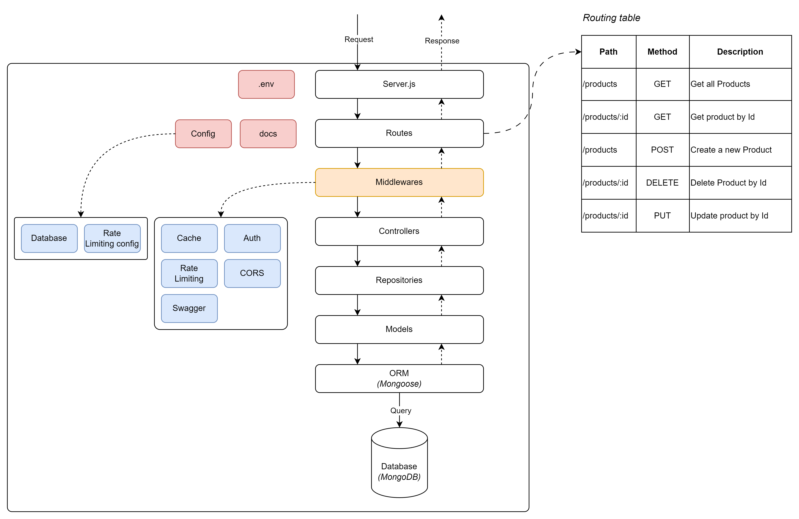

## Add Swagger Documentation

To add Swagger documentation to your Node.js API, we will use the `swagger-jsdoc` and `swagger-ui-express` packages.

`swagger-jsdoc` is used to generate Swagger specification from JSDoc comments, and `swagger-ui-express` allows us to serve the Swagger UI to view the documentation.

## Install the Swagger Packages

Install the swagger-jsdoc and swagger-ui-express packages:

```bash
npm install swagger-jsdoc swagger-ui-express
```

## Add Swagger Configuration

In the root of your project, create a folder named `docs` then create a file named `swagger.js` to define your Swagger configuration:

```js
// docs/swagger.js
const swaggerJsdoc = require("swagger-jsdoc");

const options = {
  definition: {
    openapi: "3.0.0",
    info: {
      title: "comp1682-node api documentation",
      version: "1.0.0",
      description: "API documentation for comp1682-node course",
    },
    servers: [
      {
        url: "http://localhost:3000", // Update with your server URL
      },
    ],
  },
  apis: ["./src/routes/*.js"], // Path to the API routes folder
};

const specs = swaggerJsdoc(options);

module.exports = specs;
```

## Serve Swagger UI in the Express App

In the `server.js` file, update the server configuration to serve the Swagger UI:

```js
// server.js

// ... (other imports)
const swaggerUi = require("swagger-ui-express");
const specs = require("./src/docs/swagger"); // Import the Swagger configuration

// ... (previous code)
// Serve Swagger UI
app.use("/api-docs", swaggerUi.serve, swaggerUi.setup(specs));
// ... (remaining code)
```

## Add JSDoc Comments to the Routes

In the route files (`productRoutes.js`, `userRoutes.js`), add JSDoc comments to document the API endpoints.

Below are the complete JSDoc comments for the productRoutes.js and userRoutes.js files, including documentation for all the routes:

```js
// productRoutes.js
/**
 * @swagger
 * tags:
 *   name: Products
 *   description: Product management
 */

/**
 * @swagger
 * /products:
 *   get:
 *     summary: Get all products
 *     tags: [Products]
 *     responses:
 *       200:
 *         description: Successful operation
 *       500:
 *         description: Internal server error
 */

/**
 * @swagger
 * /products/{id}:
 *   get:
 *     summary: Get a product by ID
 *     tags: [Products]
 *     parameters:
 *       - in: path
 *         name: id
 *         schema:
 *           type: string
 *         required: true
 *         description: Product ID
 *     responses:
 *       200:
 *         description: Successful operation
 *       404:
 *         description: Product not found
 *       500:
 *         description: Internal server error
 */

/**
 * @swagger
 * /products:
 *   post:
 *     summary: Create a new product
 *     tags: [Products]
 *     requestBody:
 *       required: true
 *       content:
 *         application/json:
 *           schema:
 *             type: object
 *             properties:
 *               name:
 *                 type: string
 *               description:
 *                 type: string
 *               price:
 *                 type: number
 *             required:
 *               - name
 *               - description
 *               - price
 *     responses:
 *       201:
 *         description: Product created successfully
 *       400:
 *         description: Bad request
 *       500:
 *         description: Internal server error
 */

/**
 * @swagger
 * /products/{id}:
 *   put:
 *     summary: Update a product by ID
 *     tags: [Products]
 *     parameters:
 *       - in: path
 *         name: id
 *         schema:
 *           type: string
 *         required: true
 *         description: Product ID
 *     requestBody:
 *       required: true
 *       content:
 *         application/json:
 *           schema:
 *             type: object
 *             properties:
 *               name:
 *                 type: string
 *               description:
 *                 type: string
 *               price:
 *                 type: number
 *     responses:
 *       200:
 *         description: Product updated successfully
 *       404:
 *         description: Product not found
 *       500:
 *         description: Internal server error
 */

/**
 * @swagger
 * /products/{id}:
 *   delete:
 *     summary: Delete a product by ID
 *     tags: [Products]
 *     parameters:
 *       - in: path
 *         name: id
 *         schema:
 *           type: string
 *         required: true
 *         description: Product ID
 *     responses:
 *       204:
 *         description: Product deleted successfully
 *       404:
 *         description: Product not found
 *       500:
 *         description: Internal server error
 */
```

```js
// userRoutes.js
/**
 * @swagger
 * tags:
 *   name: Users
 *   description: User management
 */

/**
 * @swagger
 * /users:
 *   post:
 *     summary: Create a new user
 *     tags: [Users]
 *     requestBody:
 *       required: true
 *       content:
 *         application/json:
 *           schema:
 *             type: object
 *             properties:
 *               username:
 *                 type: string
 *               password:
 *                 type: string
 *             required:
 *               - username
 *               - password
 *     responses:
 *       201:
 *         description: User registered successfully
 *       500:
 *         description: Internal server error
 */

/**
 * @swagger
 * /users/login:
 *   post:
 *     summary: User login
 *     tags: [Users]
 *     requestBody:
 *       required: true
 *       content:
 *         application/json:
 *           schema:
 *             type: object
 *             properties:
 *               username:
 *                 type: string
 *               password:
 *                 type: string
 *             required:
 *               - username
 *               - password
 *     responses:
 *       200:
 *         description: User login successful
 *         content:
 *           application/json:
 *             schema:
 *               type: object
 *               properties:
 *                 token:
 *                   type: string
 *       401:
 *         description: Unauthorized
 *       500:
 *         description: Internal server error
 */
```

## Generate and Access the Documentation

To generate the Swagger documentation and access the Swagger UI, run your server and visit http://localhost:3000/api-docs (or the appropriate server URL) in your web browser. You will see the Swagger UI with the documentation of your API endpoints.



The image below shows the updated project with swagger


