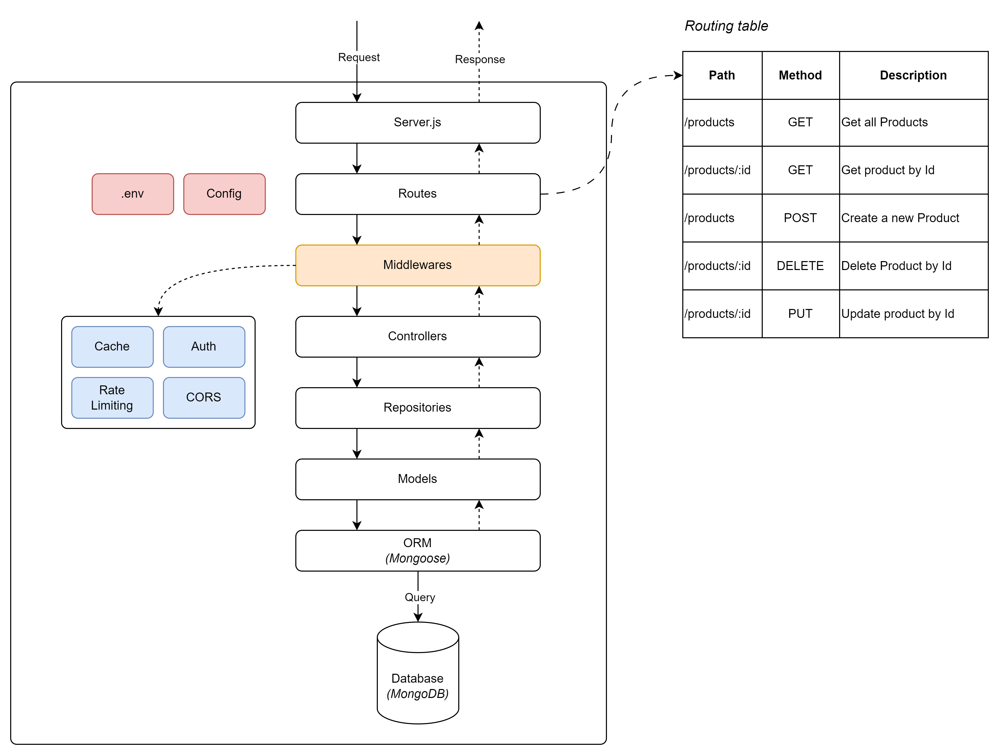

## Refactor: Move rate limiting config to middleware

The diagram below shows the current project structure



## Create a Rate Limiter Middleware

In the middlewares folder, create a file named `rateLimitMiddleware.js`:

```js
// middlewares/rateLimitMiddleware.js
const rateLimit = require("express-rate-limit");

const limiter = rateLimit({
  windowMs: 15 * 60 * 1000, // 15 minutes
  max: 10, // Limit each IP to 100 requests per windowMs
});

module.exports = limiter;
```

## Update the Server Configuration

In the server.js file, update the server configuration to use the `rateLimitMiddleware`:

```js
// server.js
// ... (previous imports)
const rateLimitMiddleware = require("./src/middlewares/rateLimitMiddleware");

// ... (previous code)

// Apply rate limiting and cors to all requests
app.use(rateLimitMiddleware);

// ... (remaining code)
```
