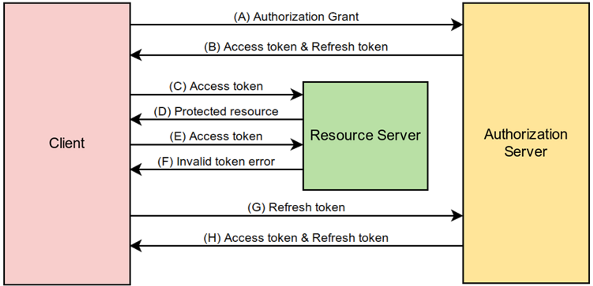
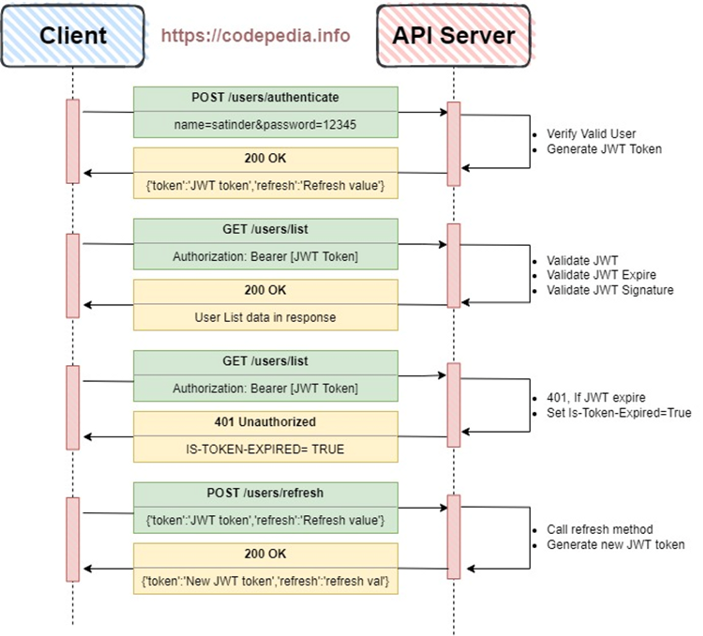

## Refresh Token

Implementing a refresh token system involves generating and managing two types of tokens: access tokens (short-lived tokens) and refresh tokens (long-lived tokens).

When the access token expires, the client can use the refresh token to obtain a new access token without requiring the user to log in again.





## Update .env

Add the following token secrets for access and refresh tokens.

```bash
ACCESS_TOKEN_SECRET=access_token_secret
REFRESH_TOKEN_SECRET=refresh_token_secret
```

## Update the User Controller

In the `controllers` folder, update the `userController.js` file to include the refresh token generation:

```js
// controllers/userController.js
const jwt = require("jsonwebtoken");
const bcrypt = require("bcrypt");
const userRepository = require("../repositories/userRepository");

const ACCESS_TOKEN_SECRET = process.env.ACCESS_TOKEN_SECRET;
const REFRESH_TOKEN_SECRET = process.env.REFRESH_TOKEN_SECRET;

class UserController {
  // ... (previous code)

  async loginUser(req, res) {
    // ... (previous code)

    const token = generateAccessToken({
      id: user._id,
      username: user.username,
    });
    const refreshToken = generateRefreshToken({
      id: user._id,
      username: user.username,
    });

    res.json({ token, refreshToken });
  }
}

function generateAccessToken(payload) {
  return jwt.sign(payload, ACCESS_TOKEN_SECRET, { expiresIn: "15m" });
}

function generateRefreshToken(payload) {
  return jwt.sign(payload, REFRESH_TOKEN_SECRET, { expiresIn: "7d" });
}

module.exports = new UserController();
```

## Modify the Auth Middleware

In the `middlewares` folder, update the `authMiddleware.js` file to handle both access tokens and refresh tokens:

```js
// middlewares/authMiddleware.js
const jwt = require("jsonwebtoken");
const dotenv = require("dotenv");

dotenv.config();
const ACCESS_TOKEN_SECRET = process.env.ACCESS_TOKEN_SECRET;
const REFRESH_TOKEN_SECRET = process.env.REFRESH_TOKEN_SECRET;

function authMiddleware(req, res, next) {
  const accessToken = req.header("Authorization");

  if (!accessToken) {
    return res.status(401).json({ error: "Unauthorized" });
  }

  jwt.verify(
    accessToken.replace("Bearer ", ""),
    ACCESS_TOKEN_SECRET,
    (err, user) => {
      if (err) {
        const refreshToken = req.header("Refresh-Token");
        if (!refreshToken) {
          return res.status(403).json({ error: "Invalid token" });
        }

        jwt.verify(refreshToken, REFRESH_TOKEN_SECRET, (err, user) => {
          if (err) {
            return res.status(403).json({ error: "Invalid refresh token" });
          }

          const newAccessToken = generateAccessToken({
            id: user.id,
            username: user.username,
          });
          req.user = user;
          req.token = newAccessToken;
          next();
        });
      } else {
        req.user = user;
        next();
      }
    }
  );
}

function generateAccessToken(payload) {
  return jwt.sign(payload, ACCESS_TOKEN_SECRET, { expiresIn: "15m" });
}

module.exports = authMiddleware;
```

## Update the User Routes

In the routes folder, update the `userRoutes.js`file to handle token refresh:

```js
// routes/userRoutes.js
const express = require("express");
const router = express.Router();
const userController = require("../controllers/userController");

// ... (previous code)

// Refresh access token using refresh token
router.post("/refresh-token", userController.refreshAccessToken);

module.exports = router;
```

## Update the User Controller

In the `controllers` folder, update the `userController.js` file to include the refreshAccessToken function:

```js
// controllers/userController.js
const jwt = require("jsonwebtoken");
const userRepository = require("../repositories/userRepository");

const ACCESS_TOKEN_SECRET = process.env.ACCESS_TOKEN_SECRET;
const REFRESH_TOKEN_SECRET = process.env.REFRESH_TOKEN_SECRET;

class UserController {
  // ... (previous code)

  async refreshAccessToken(req, res) {
    const refreshToken = req.header("Refresh-Token");

    if (!refreshToken) {
      return res.status(401).json({ error: "No refresh token provided" });
    }

    jwt.verify(refreshToken, REFRESH_TOKEN_SECRET, (err, user) => {
      if (err) {
        return res.status(403).json({ error: "Invalid refresh token" });
      }

      const newAccessToken = generateAccessToken({
        id: user.id,
        username: user.username,
      });
      res.json({ token: newAccessToken });
    });
  }
}

// ... (the rest of the code)

module.exports = new UserController();
```

Now, when a user logs in, the API will return both an access token and a refresh token.

The access token will be used to access protected routes, and the client can use the refresh token to get a new access token whenever the previous one expires without requiring the user to log in again.

The refresh token will be stored securely on the client-side, and the client will need to include it in the Refresh-Token header when making a request to refresh the access token.


