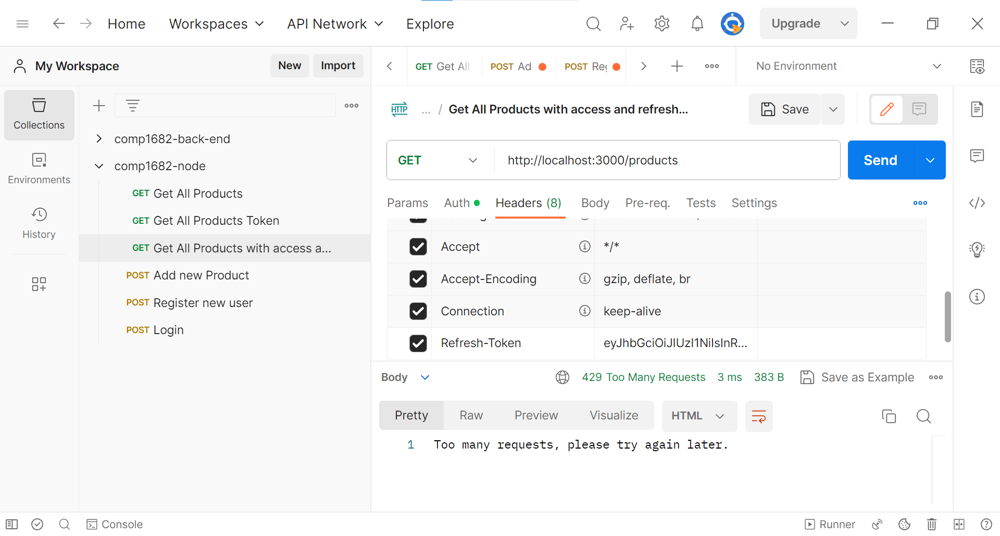

## Rate Limiting

To add rate limiting to your API, you can use the express-rate-limit middleware.

This will help prevent abuse of your API by limiting the number of requests a client can make within a certain time window.

Let's integrate rate limiting into the API:

## Install the Rate Limiting Middleware

Install the express-rate-limit middleware:

```bash
npm install express-rate-limit
```

## Configure Rate Limiting

In the `server.js` file, configure the rate limiting middleware for your API:

```js
// server.js
const express = require("express");
const dotenv = require("dotenv");
const productRoutes = require("./src/routes/productRoutes");
const userRoutes = require("./src/routes/userRoutes");
const authMiddleware = require("./src/middlewares/authMiddleware");
const connectToDatabase = require("./src/config/database");
const rateLimit = require("express-rate-limit");

dotenv.config();
const app = express();
const PORT = process.env.PORT || 3000;

// Rate limiting configuration
const limiter = rateLimit({
  windowMs: 15 * 60 * 1000, // 15 minutes
  max: 10, // Limit each IP to 10 requests per windowMs
});

// Apply rate limiting to all requests
app.use(limiter);

// Middleware
app.use(express.json());

// Connect to MongoDB
connectToDatabase();

// Routes
app.use("/products", authMiddleware, productRoutes);
app.use("/users", userRoutes);

// Start the server
app.listen(PORT, () => {
  console.log(`Server listening on port ${PORT}`);
});
```

In this example, we have limited each IP address to 10 requests per 15 minutes. Adjust the windowMs and max values as per your requirements.


