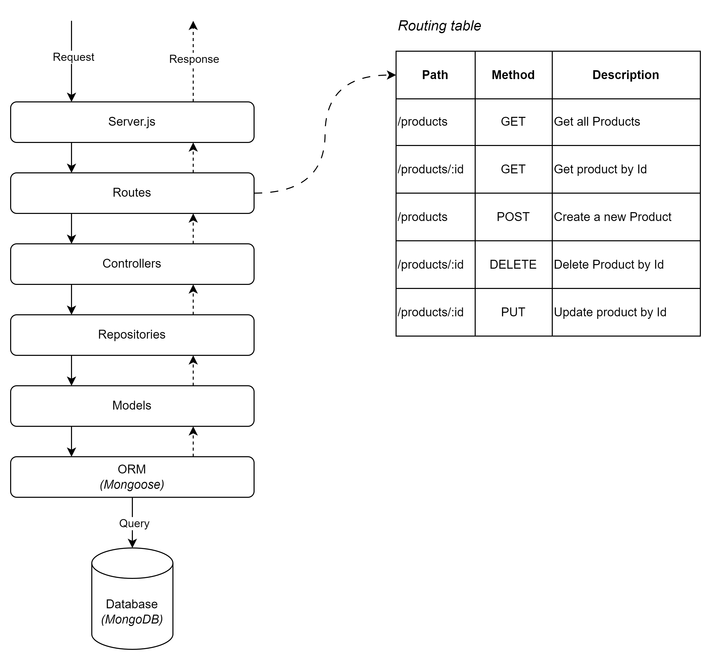

# Setup Project

## Set Up Folder Structure

Create the following folder structure:

```bash
project_root/
  |- src/
      |- controllers/
      |- models/
      |- repositories/
      |- routes/
  |- .env
  |- package.json
  |- server.js
```

Let's break down each folder and its purpose:

`project_root/`: This is the root directory of your Node.js project. It contains all the project files and folders.

`src/`: This is where the actual source code of your application resides.

`server.js`: This file is typically the entry point of your application. It sets up the server and wires together all the components, such as initializing the routes, connecting to the database, and starting the server.

`routes/`: In this folder, you'll find the route files that define the various endpoints and the associated request handling. Routes determine what happens when a specific URL or endpoint is accessed by a client, and they call the appropriate controller functions to process the request and generate a response.

`controllers/`: This folder typically contains the controller files. In the context of web development, controllers are responsible for handling incoming requests, processing data, and returning appropriate responses. They act as intermediaries between routes and models.

`repositories/`: This folder often holds the data access layer or repository files. A repository is responsible for encapsulating the logic that interacts with the database or other data sources. It allows the controllers to access and manipulate data without directly interacting with the underlying data store.

`models/`: The models folder is used to define the data models for your application. A model represents the structure of your data and may include database schemas or any other data-related logic.

`.env`: This is a file used to store environment variables for your application. Environment variables often include sensitive information (e.g., API keys, database credentials) or configuration settings that can vary between different deployment environments (e.g., development, staging, production).

`package.json`: This file is crucial in Node.js projects as it contains metadata about the project, including its dependencies, version, scripts, and more. It also defines the entry point of the application.

The diagram below shows how these components work together



## Initialize Project and Install Dependencies

Initialize a new Node.js project and install the required dependencies:

```bash
# Initialize Node.js project
npm init -y

# Install dependencies
npm install express mongoose dotenv
```

## Configure .env

In the root of your project, create a file named .env and add your MongoDB connection URL. For example:

```bash
MONGODB_URI=mongodb://localhost:27017/your-database-name
```
