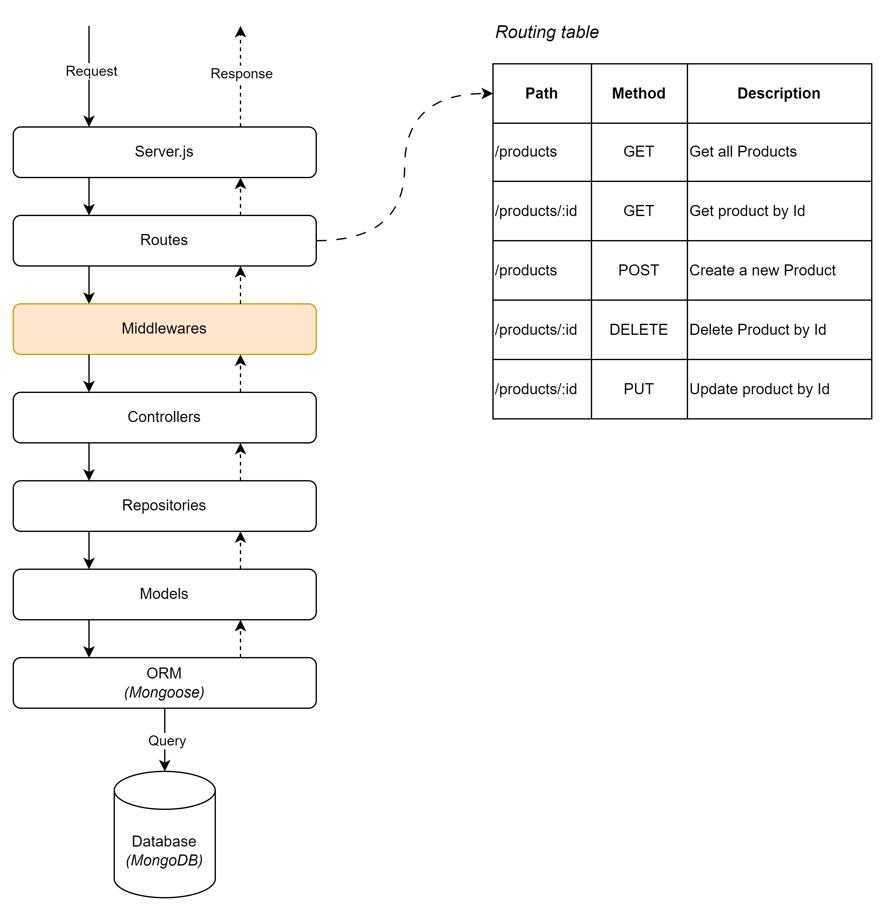
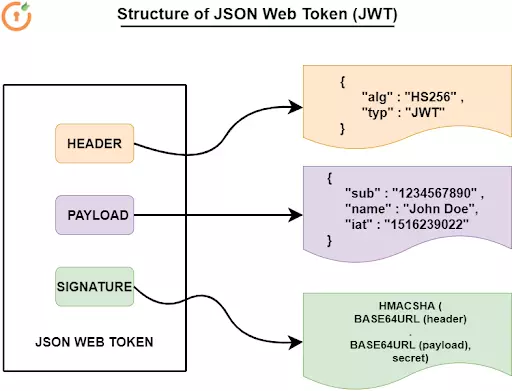
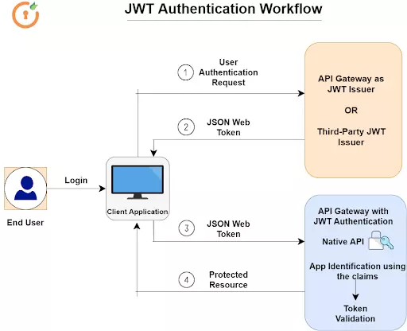
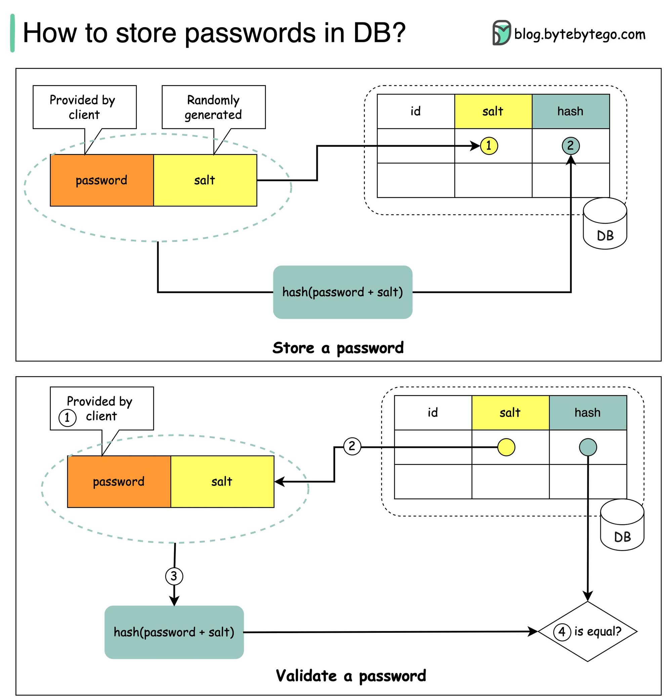
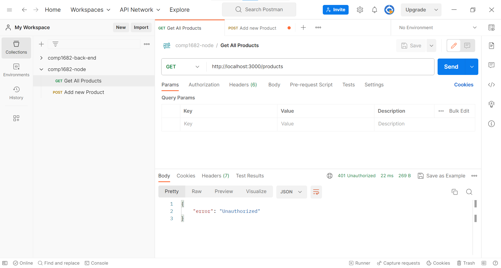
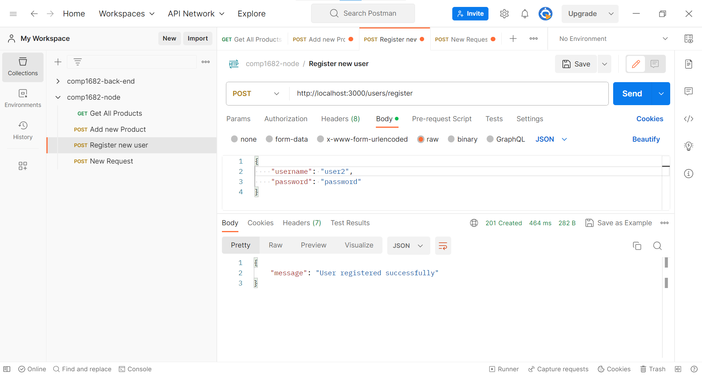
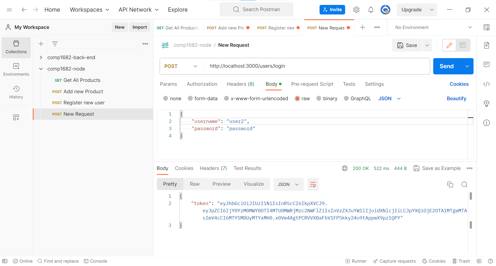
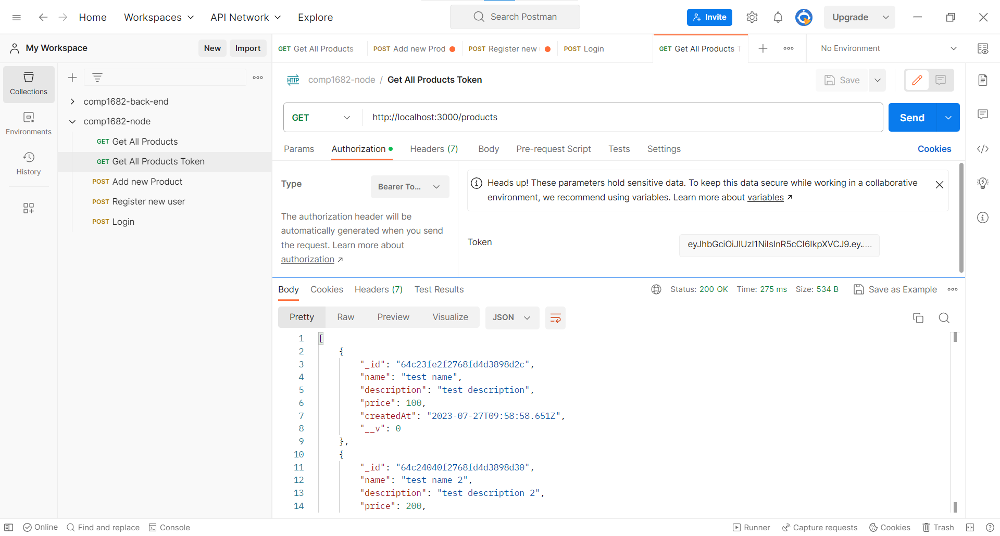

## Authentication with JSON WEB TOKEN (JWT)

Update the folder structure to include the middlewares folder:

```bash
project_root/
  |- src/
      |- controllers/
      |- models/
      |- repositories/
      |- routes/
      |- middlewares/
  |- .env
  |- package.json
  |- server.js
```

`middlewares/`: This folder is where you place your custom middleware functions. A middleware function is essentially a JavaScript function that has access to the request (`req`), response (`res`), and the `next` function, which is used to pass control to the next middleware in the chain.

The diagram below shows how middleware functions in the chain



## What is Json Web Token (JWT)

JWT stands for "JSON Web Token." It is a compact and self-contained way of representing information between two parties in a secure manner as a JSON object. JWTs are commonly used for authentication and authorization purposes in web applications.

The structure of a JWT consists of three parts, separated by dots:

`Header`: Contains metadata about the type of token and the cryptographic algorithm used to sign the token.
Example:

```json
{
  "alg": "HS256",
  "typ": "JWT"
}
```

`Payload`: Contains the claims or information about the user or entity. There are three types of claims:

```json
{
  "sub": "user123",
  "name": "John Doe",
  "admin": true
}
```

`Signature`: To create the signature, the header, payload, and a secret (or private key) are used as input to a cryptographic algorithm specified in the header. The signature is used to verify the integrity of the token and to ensure that the token hasn't been tampered with.

Example of a signature (not a real signature; just for illustration purposes):

```
HMACSHA256(
  base64UrlEncode(header) + "." + base64UrlEncode(payload),
  secret
)
```



JWTs are typically used in authentication scenarios. When a user logs in, the server generates a JWT containing relevant information about the user and signs it using a secret key.

The client then receives the JWT and includes it in subsequent requests to access protected resources on the server.

The server can verify the authenticity of the token and extract the user information from it without the need to store user session data, resulting in a stateless authentication mechanism.



## How to store Password securely in Database

https://www.youtube.com/watch?v=zt8Cocdy15c



## Install Additional Dependencies

Install the required dependencies for authentication

```
npm install jsonwebtoken bcrypt
```

## Create the User Model

In the models folder, create a file named `user.js`

```js
// models/user.js
const mongoose = require("mongoose");

const userSchema = new mongoose.Schema({
  username: { type: String, required: true, unique: true },
  password: { type: String, required: true },
});

const User = mongoose.model("User", userSchema);

module.exports = User;
```

## Create the User Repository

In the repositories folder, create a file named `userRepository.js`:

```js
// repositories/userRepository.js
const User = require("../models/user");

class UserRepository {
  async createUser(data) {
    return await User.create(data);
  }

  async getUserByUsername(username) {
    return await User.findOne({ username });
  }
}

module.exports = new UserRepository();
```

## Create the Authentication Middleware

In the middlewares folder, create a file named `authMiddleware.js`

```js
// middlewares/authMiddleware.js
const jwt = require("jsonwebtoken");
const dotenv = require("dotenv");

dotenv.config();
const secretKey = process.env.JWT_SECRET;

function authMiddleware(req, res, next) {
  const token = req.header("Authorization");

  if (!token) {
    return res.status(401).json({ error: "Unauthorized" });
  }

  try {
    const decoded = jwt.verify(token.replace("Bearer ", ""), secretKey);
    req.user = decoded;
    next();
  } catch (err) {
    return res.status(403).json({ error: "Invalid token" });
  }
}

module.exports = authMiddleware;
```

## Create the User Controller

In the controllers folder, create the `userController.js` file to include user registration and authentication functions

```js
// controllers/userController.js
const jwt = require("jsonwebtoken");
const bcrypt = require("bcrypt");
const userRepository = require("../repositories/userRepository");
const dotenv = require("dotenv");

dotenv.config();
const secretKey = process.env.JWT_SECRET;

class UserController {
  async registerUser(req, res) {
    try {
      const { username, password } = req.body;
      const hashedPassword = await bcrypt.hash(password, 10);
      const user = await userRepository.createUser({
        username,
        password: hashedPassword,
      });
      res.status(201).json({ message: "User registered successfully" });
    } catch (err) {
      res.status(500).json({ error: "Unable to register user" });
    }
  }

  async loginUser(req, res) {
    try {
      const { username, password } = req.body;
      const user = await userRepository.getUserByUsername(username);

      if (!user) {
        return res.status(401).json({ error: "Invalid credentials" });
      }

      const isPasswordValid = await bcrypt.compare(password, user.password);

      if (!isPasswordValid) {
        return res.status(401).json({ error: "Invalid credentials" });
      }

      const token = jwt.sign(
        { id: user._id, username: user.username },
        secretKey,
        { expiresIn: "1h" }
      );
      res.json({ token });
    } catch (err) {
      res.status(500).json({ error: "Unable to log in" });
    }
  }
}

module.exports = new UserController();
```

## Update the User Routes

In the `routes` folder, update the `userRoutes.js` file to include routes for user registration and authentication

```js
// routes/userRoutes.js
const express = require("express");
const router = express.Router();
const userController = require("../controllers/userController");

// Register a new user
router.post("/register", userController.registerUser);

// Login user and get JWT token
router.post("/login", userController.loginUser);

module.exports = router;
```

## Protect the /products Route

In the `server.js` file, use the authentication middleware to protect the `/products` route

```js
// server.js

// ... (previous imports)
const userRoutes = require("./src/routes/userRoutes");
// ... (remaining imports)

// ... (previous code)

const authMiddleware = require("./src/middlewares/authMiddleware");
app.use("/products", authMiddleware, productRoutes);
app.use("/users", userRoutes);

// ... (remaining code)
```

With these changes, your API now has user registration, login functionality, and the `/products` route is protected using JWT Bearer token authentication. When you make a request to `/products`, you need to include a valid JWT token in the Authorization header to access the route.

## Test with Postman

Now, if we don't login first, we cannot access the `/products` route



First, we need to create a new user



After we login, we include the `token` in the header then make the request to `/products`. Voila, we can access the resources




